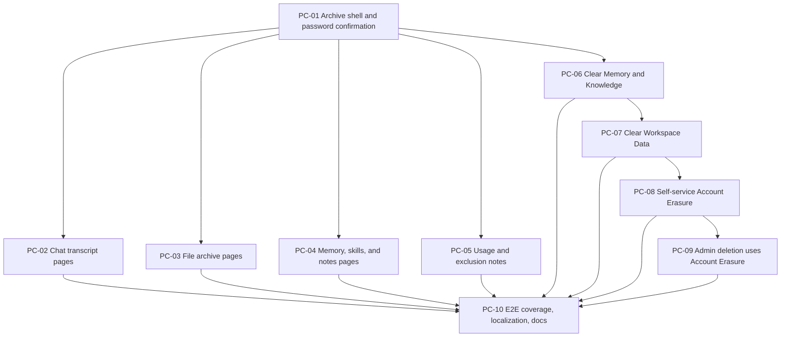

# Privacy Controls Implementation Issues

This document converts the agreed Privacy and Data Controls plan into local, issue-ready vertical slices. It is intentionally written like tracker issues, but kept local because the current request is to document the implementation rather than publish tickets.

## Source Decisions

- Domain terms: `CONTEXT.md` under Privacy Controls.
- Product specification: `docs/privacy-controls-and-account-data-archive.md`.
- ADRs:
  - `docs/adr/0029-account-erasure-keeps-only-anonymous-aggregates.md`
  - `docs/adr/0030-account-erasure-quiesces-user-work.md`
  - `docs/adr/0031-account-erasure-detaches-shared-admin-content.md`
  - `docs/adr/0032-account-data-archive-is-human-readable.md`
- Approved prototypes:
  - `docs/prototypes/account-data-archive.html`
  - `docs/prototypes/chat-quarterly-roadmap-planning.html`
  - `docs/prototypes/memory-compact-planning-documents.html`

## Implementation Rules

- Use the project terms **Privacy and Data Controls**, **Account Data Archive**, **Clear Memory and Knowledge**, **Clear Workspace Data**, and **Account Erasure**.
- Every user-facing control is available to every signed-in user from Profile.
- Every privacy action requires password confirmation.
- Destructive confirmation surfaces offer **Download my data** as a secondary action, but deletion is never blocked on downloading an archive.
- Account Data Archive is transient, self-service, and signed-in-user only. Admins cannot download another user's archive in v1.
- Account Data Archive must fully fail if any in-scope section cannot be loaded or written.
- Stable archive folder and file names are English. Stored user content stays in the language stored in the database.
- Do not add JSON appendices by default. The archive is for people, not an importer contract.
- Before coding framework/library surfaces, check current docs through Context7 or the Svelte docs path required by `AGENTS.md`.
- Before completion, run `npm run check` and Fallow.

## Slice Index

1. PC-01 - Download my data creates a password-confirmed archive shell
2. PC-02 - Account Data Archive includes chat transcript pages
3. PC-03 - Account Data Archive includes original and readable file pages
4. PC-04 - Account Data Archive includes memory, skills, and notes pages
5. PC-05 - Account Data Archive includes personal usage summaries and exclusion notes
6. PC-06 - Clear Memory and Knowledge removes memory-side data while preserving chats
7. PC-07 - Clear Workspace Data removes workspace data and signs the user out
8. PC-08 - Account Erasure deletes the signed-in account after quiescing user work
9. PC-09 - Admin user deletion reuses Account Erasure and detaches shared content
10. PC-10 - Privacy controls receive end-to-end coverage, localization, and release docs

## PC-01 - Download my data creates a password-confirmed archive shell

**Type:** AFK

### What to build

Create the first complete Account Data Archive path from Profile: a signed-in user opens **Privacy and Data Controls**, chooses **Download my data**, confirms their password, and receives a transient ZIP containing the approved HTML entry page, profile/preferences, avatar if present, and the top-level archive navigation.

This slice establishes the shared password-confirmation pattern, the archive generation boundary, ZIP streaming, neutral download filename, all-or-nothing failure behavior, and the approved visual direction for the entry page. It should not yet include every data category; later slices extend the same archive generator.

### Acceptance criteria

- [ ] Profile shows **Privacy and Data Controls** with **Download my data**, **Clear memory and knowledge**, **Clear workspace data**, and **Delete account** labels.
- [ ] **Download my data** requires password confirmation before any archive generation begins.
- [ ] Password failures return a clear user-facing error and do not start archive generation.
- [ ] The generated ZIP is streamed or otherwise returned transiently without durable export history or retained ZIP files.
- [ ] The download filename is neutral, date-based, and does not contain email or display name.
- [ ] The ZIP starts with `Open AlfyAI Data Archive.html`.
- [ ] The entry page matches the approved prototype structure: AlfyAI light branding, no `Overview` nav item, collapsible sections, sticky mobile section navigation, avatar rendered as an image, no file-location pills in section headers.
- [ ] The archive includes profile facts and preferences while excluding secrets, password data, active sessions, cookies, API keys, service assertions, storage paths, and app/admin secrets.
- [ ] Archive generation fully fails with a clear error if profile/avatar/entry-page writing fails.
- [ ] Unit or integration tests cover password confirmation, transient archive response headers, neutral filename, entry file presence, and all-or-nothing failure.

### Blocked by

None - can start immediately.

## PC-02 - Account Data Archive includes chat transcript pages

**Type:** AFK

### What to build

Extend Account Data Archive so the **Chats** section lists the user's conversations and links to individual chat transcript pages. Each transcript page shows only user messages and assistant responses in a readable conversation layout, with message timestamps and links to archive files used in that chat.

Chat pages must avoid assistant thinking traces, hidden context, provider/tool payloads, retry/debug fields, and diagnostic metadata. Imported ChatGPT conversations should include readable provenance that explains they were imported without including the original raw import ZIP.

### Acceptance criteria

- [ ] The archive entry page **Chats** section lists conversations owned by the signed-in user.
- [ ] Each listed chat opens a readable HTML transcript page modeled after `chat-quarterly-roadmap-planning.html`.
- [ ] Transcript pages include user messages and assistant responses only.
- [ ] Transcript pages include simple timestamps when available.
- [ ] Transcript pages link to uploaded or generated files that are included elsewhere in the archive.
- [ ] Imported ChatGPT conversations show plain provenance such as import date/source when available.
- [ ] The export excludes assistant thinking traces, hidden context, raw tool JSON, provider payloads, retry/debug fields, and diagnostic metadata.
- [ ] The export fully fails if any in-scope conversation or message cannot be loaded or written.
- [ ] Tests cover normal conversations, empty conversations, imported conversations, file-linked conversations, and exclusion of non-user-facing message metadata.

### Blocked by

- PC-01 - Download my data creates a password-confirmed archive shell

## PC-03 - Account Data Archive includes original and readable file pages

**Type:** AFK

### What to build

Extend Account Data Archive so the **Files** section includes original uploaded Knowledge Base files, original generated files, and readable previews or extracted text pages where the app already has safe readable content. Chat transcript file links should resolve to these archived copies.

The archive should not invent new document extraction work during export if that would make generation slow or unreliable. It should include existing originals and existing readable representations, then fail clearly if any in-scope original file cannot be copied into the ZIP.

### Acceptance criteria

- [ ] The archive includes original uploaded Knowledge Base files owned by the signed-in user.
- [ ] The archive includes original generated files owned by the signed-in user.
- [ ] The archive includes readable text/HTML previews when the app already has readable extracted content.
- [ ] Chat transcript file links resolve to the archived file copies or readable preview pages.
- [ ] File names and folders use stable English archive structure while preserving original user-visible filenames where practical.
- [ ] The archive excludes raw import ZIPs, parser internals, summarizer state, embedding state, server logs, and storage paths.
- [ ] Archive generation fully fails if an in-scope original file cannot be loaded or written.
- [ ] Tests cover uploaded files, generated files, existing readable previews, missing file failure, and link integrity from chat pages to file entries.

### Blocked by

- PC-01 - Download my data creates a password-confirmed archive shell
- PC-02 - Account Data Archive includes chat transcript pages

## PC-04 - Account Data Archive includes memory, skills, and notes pages

**Type:** AFK

### What to build

Extend Account Data Archive so the **Memory** section lists app-controlled memory in readable language and links to individual memory detail pages modeled after `memory-compact-planning-documents.html`. Include user-created Skill definitions and Skill Notes in readable pages when they belong to the signed-in user.

Memory pages should explain what was remembered, the type of memory, saved/updated dates when available, and readable source references when available. They must not expose implementation vocabulary or hidden prompt/context internals.

### Acceptance criteria

- [ ] The archive entry page **Memory** section lists remembered items in plain language.
- [ ] Each memory item can link to a readable memory detail page.
- [ ] Memory detail pages show the remembered statement first, then type/status/date/source information.
- [ ] User-created Skill definitions are included in readable archive pages.
- [ ] Skill Notes owned by the user are included in readable archive pages.
- [ ] App-controlled external memory state is included when AlfyAI owns enough data to export it for the signed-in user.
- [ ] The export excludes hidden prompt context, embedding vectors, embedding hashes, retrieval diagnostics, and raw memory-provider payloads.
- [ ] The export fully fails if in-scope memory, user Skill, or Skill Note data cannot be loaded or written.
- [ ] Tests cover memory with source references, memory without source references, user Skill definitions, Skill Notes, and exclusion of implementation-only memory fields.

### Blocked by

- PC-01 - Download my data creates a password-confirmed archive shell

## PC-05 - Account Data Archive includes personal usage summaries and exclusion notes

**Type:** AFK

### What to build

Extend Account Data Archive so the **Usage** section includes readable personal analytics summaries and simple tables, and the **What is not included** section clearly names excluded areas. Atlas outputs should export as generated files, while raw Atlas checkpoints/state should stay excluded rather than silently leaking.

Usage data should be personal and understandable, not a raw analytics dump. It may include message counts, token totals, estimated costs, model/provider categories if user-facing enough, and date-bucketed totals when available.

### Acceptance criteria

- [ ] The archive includes a personal usage summary with simple totals and tables.
- [ ] Usage export avoids raw analytics event payloads, debug fields, local process logs, and server logs.
- [ ] The archive includes produced Atlas files as generated files.
- [ ] The archive includes clear exclusion notes for passwords, active logins, private server settings, server logs, hidden context, outside AI provider logs outside AlfyAI control, and other excluded data categories.
- [ ] Raw Atlas checkpoints/state are not exported and do not fail archive generation.
- [ ] In-scope usage summary load/write failures still fail the entire archive.
- [ ] Tests cover populated usage summaries, users with no usage rows exclusion wording, and all-or-nothing failure for in-scope usage data.

### Blocked by

- PC-01 - Download my data creates a password-confirmed archive shell

## PC-06 - Clear Memory and Knowledge removes memory-side data while preserving chats

**Type:** AFK

### What to build

Implement **Clear memory and knowledge** as a password-confirmed profile action that removes remembered context, Knowledge Base documents, document-derived context, continuity state, embeddings, working-set/context status, and stored evidence traces while keeping the user's account and chat conversations.

Generated chat files remain available as chat outputs. The user stays signed in after completion.

### Acceptance criteria

- [ ] Profile exposes **Clear memory and knowledge** in Privacy and Data Controls.
- [ ] The action requires password confirmation.
- [ ] The confirmation surface offers **Download my data** as a secondary action.
- [ ] The action deletes user-owned Knowledge Base documents and uploaded knowledge artifacts.
- [ ] The action deletes app-controlled memory, continuity state, working-set/context status, semantic embeddings, and stored evidence traces for the user.
- [ ] The action preserves chat conversations and visible chat messages.
- [ ] The action preserves generated chat files as downloadable outputs where they are still part of chat history.
- [ ] The user remains signed in and sees a clear completion state.
- [ ] Tests cover password failure, deletion scope, preservation of chats, preservation of generated chat files, and idempotent repeat execution.

### Blocked by

- PC-01 - Download my data creates a password-confirmed archive shell

## PC-07 - Clear Workspace Data removes workspace data and signs the user out

**Type:** AFK

### What to build

Implement **Clear workspace data** as a password-confirmed profile action that removes the user's chats, Knowledge Base content, app-controlled memory, generated files, and workspace continuity while keeping login identity, profile settings, avatar, and identifiable historical analytics.

The action signs the user out after completion because the active workspace state has been wiped.

### Acceptance criteria

- [ ] Profile exposes **Clear workspace data** in Privacy and Data Controls.
- [ ] The action requires password confirmation.
- [ ] The confirmation surface offers **Download my data** as a secondary action.
- [ ] The action deletes conversations, messages, chat attachments, generated files, file-production records, Knowledge Base content, app-controlled memory, continuity state, working-set/context status, semantic embeddings, and stored evidence traces owned by the user.
- [ ] The action preserves the user account, login credential, profile settings, avatar, and identifiable historical analytics.
- [ ] The action cancels or prevents user-owned in-flight workspace work from recreating workspace records after completion.
- [ ] The user is signed out after successful completion.
- [ ] Tests cover password failure, deletion scope, preserved profile/account data, sign-out behavior, and idempotent repeat execution.

### Blocked by

- PC-06 - Clear Memory and Knowledge removes memory-side data while preserving chats

## PC-08 - Account Erasure deletes the signed-in account after quiescing user work

**Type:** AFK

### What to build

Implement self-service **Delete account** as Account Erasure. The signed-in user confirms their password, AlfyAI quiesces user-owned running work, deletes local personal workspace/account data and app-controlled external memory state, preserves only anonymous aggregate usage and cost totals, and signs the user out.

Self-service Account Erasure must not be blocked by the last-admin guard. Admin deletion of another user is handled separately in PC-09.

### Acceptance criteria

- [ ] Profile exposes **Delete account** in Privacy and Data Controls using Account Erasure behavior.
- [ ] The action requires password confirmation.
- [ ] The confirmation surface offers **Download my data** as a secondary action.
- [ ] The action quiesces user-owned running work before destructive cleanup, including live chat streams, file production, and memory maintenance.
- [ ] The action deletes conversations, messages, files, Knowledge Base content, app-controlled memory, continuity state, Skill Notes, user Skill definitions, account preferences, avatar, sessions, and other person-linked local data owned by the user.
- [ ] The action removes app-controlled external memory state for the user.
- [ ] Retained analytics are anonymous aggregate usage and cost totals only.
- [ ] Retained records do not preserve email, display name, user ID, conversation title, message ID, or pseudonymous per-user rows for the erased person.
- [ ] Self-service deletion is allowed even if the signed-in user is the last admin.
- [ ] The user is signed out after successful deletion.
- [ ] Tests cover quiescence before deletion, external memory cleanup, anonymous aggregate retention, no person-linked analytics retention, last-admin self-deletion, session invalidation, and idempotent repeat execution.

### Blocked by

- PC-07 - Clear Workspace Data removes workspace data and signs the user out

## PC-09 - Admin user deletion reuses Account Erasure and detaches shared content

**Type:** AFK

### What to build

Update admin deletion of another user so it uses the same Account Erasure cleanup boundary while preserving shared deployment-level content. Shared admin-authored records such as published campaigns, provider/model configuration, system skills, and similar records survive with authorship detached or anonymized.

Admin deletion may keep the existing last-admin guard for deleting another user if that guard currently protects deployment administration.

### Acceptance criteria

- [ ] Admin deletion of another user calls the shared Account Erasure cleanup boundary rather than a separate partial cleanup path.
- [ ] Admin deletion quiesces the target user's running work before destructive cleanup.
- [ ] Admin deletion removes target-user personal workspace/account data and app-controlled external memory state.
- [ ] Published campaigns, provider/model configuration, system skills, and similar shared deployment-level records survive target-user deletion.
- [ ] Surviving shared records do not retain the erased user's identity as author/owner.
- [ ] Retained analytics follow the anonymous-aggregate-only rule.
- [ ] Existing last-admin protection for admin deletion of another user remains if currently required by admin safety rules.
- [ ] Tests cover deleting an ordinary user, deleting an admin-authored shared-content owner, preserving shared records, detached authorship, anonymous analytics retention, and last-admin admin-delete guard behavior.

### Blocked by

- PC-08 - Account Erasure deletes the signed-in account after quiescing user work

## PC-10 - Privacy controls receive end-to-end coverage, localization, and release docs

**Type:** AFK

### What to build

Complete the implementation with end-to-end coverage, English and Hungarian user-facing strings, accessibility checks, and release-facing documentation. This slice validates the whole Privacy and Data Controls workflow as a user would experience it.

This is not a design-review slice; the look and feel has already been approved through the prototypes. The goal is regression protection and operational readiness.

### Acceptance criteria

- [ ] All Privacy and Data Controls labels, descriptions, errors, confirmations, and success states are localized in English and Hungarian.
- [ ] Automated browser tests cover downloading an archive, rejecting a wrong password, clearing memory and knowledge, clearing workspace data, self-service Account Erasure, and admin deletion of another user.
- [ ] Archive browser tests inspect ZIP contents enough to confirm entry page, chat page, memory page, file links, usage page, and exclusion notes.
- [ ] Accessibility checks cover keyboard navigation, focus-visible states, modal semantics, destructive-action confirmation wording, and mobile sticky section navigation in the archive.
- [ ] Documentation names the supported v1 scope, exclusions, all-or-nothing export behavior, and data-retention consequences of each privacy action.
- [ ] Operational docs describe the cleanup order and how to investigate a failed archive or failed erasure without exposing personal data in logs.
- [ ] `npm run check` passes with zero errors and zero warnings.
- [ ] Fallow passes without new findings, or any existing unrelated findings are reported exactly.

### Blocked by

- PC-02 - Account Data Archive includes chat transcript pages
- PC-03 - Account Data Archive includes original and readable file pages
- PC-04 - Account Data Archive includes memory, skills, and notes pages
- PC-05 - Account Data Archive includes personal usage summaries and exclusion notes
- PC-06 - Clear Memory and Knowledge removes memory-side data while preserving chats
- PC-07 - Clear Workspace Data removes workspace data and signs the user out
- PC-08 - Account Erasure deletes the signed-in account after quiescing user work
- PC-09 - Admin user deletion reuses Account Erasure and detaches shared content

## Dependency Shape

## Suggested Build Order

1. PC-01 because it creates the shared Profile section, password confirmation, and archive generator boundary.
2. PC-02 through PC-05 can proceed in parallel after PC-01 if agents coordinate archive folder/link conventions.
3. PC-06 through PC-09 should proceed in order because each destructive action expands the cleanup scope.
4. PC-10 should land last after all behavior exists.

## Notes for Future Agents

- Keep route handlers as transport adapters. Put durable archive and cleanup behavior behind server service boundaries.
- Prefer reusing existing deletion/cleanup services before adding new persistence paths.
- Do not make archive generation depend on a future importer, restore flow, or raw JSON schema.
- Use readable HTML as the primary archive representation and original files as supporting artifacts.
- Treat "partial archive" as an error, not a degraded success.
- Keep raw Atlas checkpoints/state out of the account archive unless the product explicitly changes scope.
